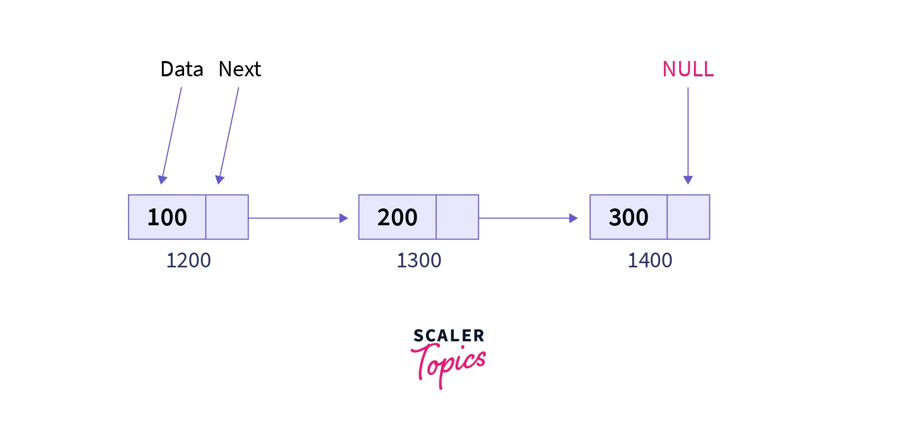

# Linked List Data Structure
A linked list is a linear data structure that consists of a sequence of nodes. Each node contains a data field and a reference (link) to the next node in the sequence. The first node in the list is called the head node, and the last node in the list is called the tail node.

# Node Structure
A node in a linked list typically consists of two components:

`Data:` This field stores the actual value or data associated with the node.
`Next Pointer:` This field stores the memory address (reference) of the next node in the sequence.

# Head and Tail
The head and tail pointers are used to access the linked list. The head pointer points to the first node in the list, and the tail pointer points to the last node in the list.

# Example:
Here is a diagram of a linked list with three nodes:

Head Node -> Node 1 -> Node 2 -> Node 3 -> Tail Node

